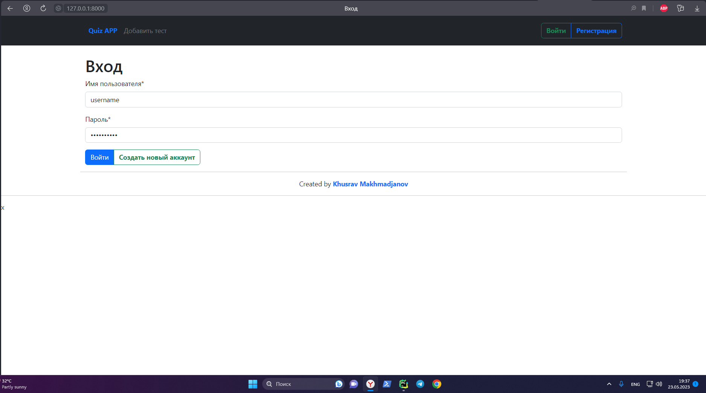

# Quiz APP в DJANGO

Это приложение позволяет создавать тесты и проходить их. И у него хороший набор функциональностей например: регистрация,
вход, выход, пользователи которые не зарегистрированы, они не смогут создавать тесты и решать их.

## Установка

* Клонировать приложение - git clone
* Установка необходимых зависимостей - pipenv install django, Pillow
* Провести миграции - python manage.py migrate

## Использование

1. Запуск из сервера - python manage.py runserver
2. Открыть сайт на браузере - http://localhost:8000
3. Создать аккаунт
4. Создать тест или пройти уже созданные мною

### Хочу поблагодарить автора канала Abdurasulov Codes за качественный контент, я написал этот проект по видеоролику на ютубе. Ссылку оставлсю внизу под ⬇️

### ДЕМО ИЗОБРАЖЕНИЕ

# Спасибо за ваще внимание - было круто писать)

Ссылка на видео по которому, я делал
проект - https://www.youtube.com/watch?v=L2jb6ubmvCo&list=PLerUjc0ALRXz34rTq3QHcH4n2kUR_Oglk